<!--
Render:  npx @marp-team/marp-cli@latest presentation/interceptors-story.md -o deck.html
Runbook: presentation/README.md
-->

<!-- _class: bleed -->

<!--
0 - 1:00 quick intro

Interceptors

2 call outs - Rick and Josh

Interceptors = keeping business glue code out of workflows

-->

---

<!-- _class: bleed -->

<!--
1:00 - 1:30

Following Rufus, the most excellent architect of the 27th century.

-->

---

<!-- _class: bleed -->

<!--
1:30 - 2:00

Simple workflow, no one woke up, anyone could travel, world peace was achieved.

-->

---

<!-- _class: bleed -->

<!--
2:00 - 4:00

Multiverse of Bill & Ted, needed improvements to the workflow to do deal with this

1/ Real auth, 2/ Only Bill for save the future, to simplify things, 3/ write outs for when trips were authorized, so we could find them later, 4/ full log correlation, so the dudes in IT could find bad trips, if they occurred, 5/ most heinous auditors needed better controls on the back end systems

oh, yeah, do it everywhere

-->

---

<!-- _class: bleed -->

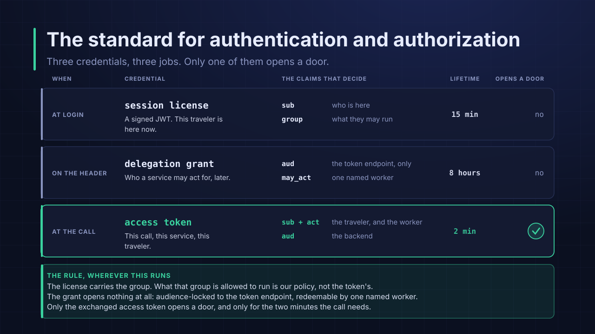

<!--

4:00 - 6:30

Great id provider; signed JWTs that are traveler credentials you can trust and need to validate based on actual clocks; delegation grants that act as a permission slip for the worker to get a token on behalf of a traveler; access token that can be used from the worker to the backend systems that can record the worker acted on behalf of a travler.
-->

---

<!-- _class: bleed -->

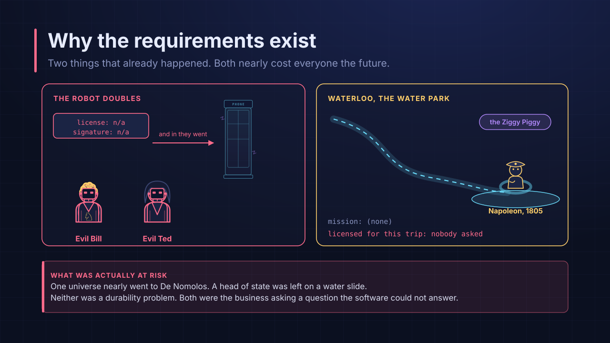

<!--
6:30 - 7:30

Here's why the requirements were there - De Nomolos; losing Napoleon with an untracked trip (d...jerk); ziggy piggy expense report.

-->

---

<!-- _class: bleed -->

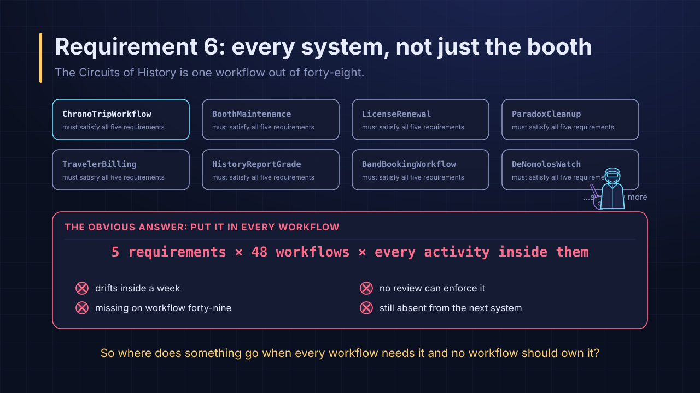

<!--

7:30 - 8:30

Helper functions were not it - too much risk, could forget them if something changed, modify a lot of code

Being the most excellent architect that he was, Rufus did some research using Temporal's AI developer assistant, asking the question "what is the most excellent way to handle heinous cross-cutting requirements that need to be handled for multiple activities and workflows?"

-->

---

<!-- _class: bleed -->

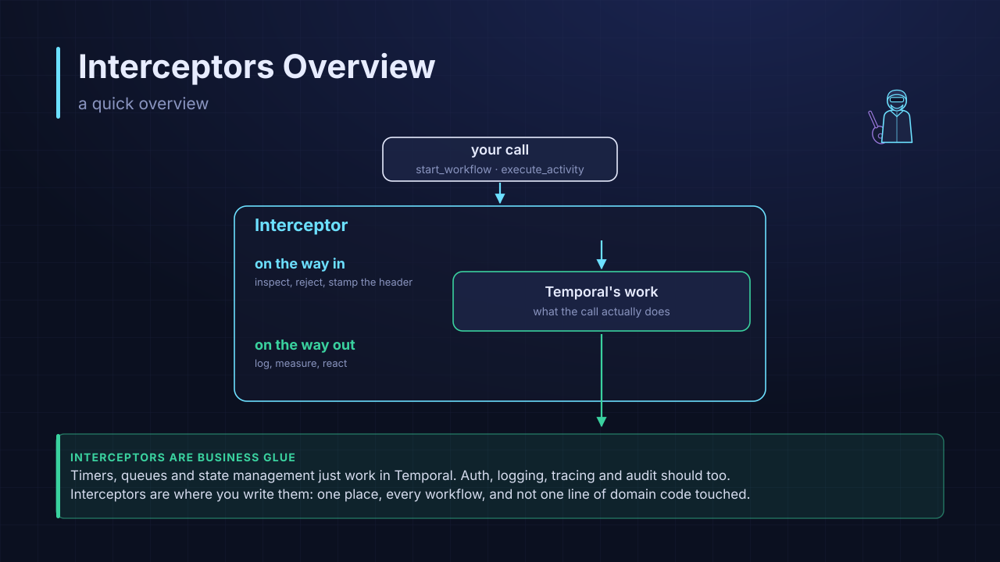

<!--
8:30 - 9:30 - 

Interceptors - Hooks for the Temporal SDK to run code before and after Temporal SDK calls

-->

---

<!-- _class: bleed -->

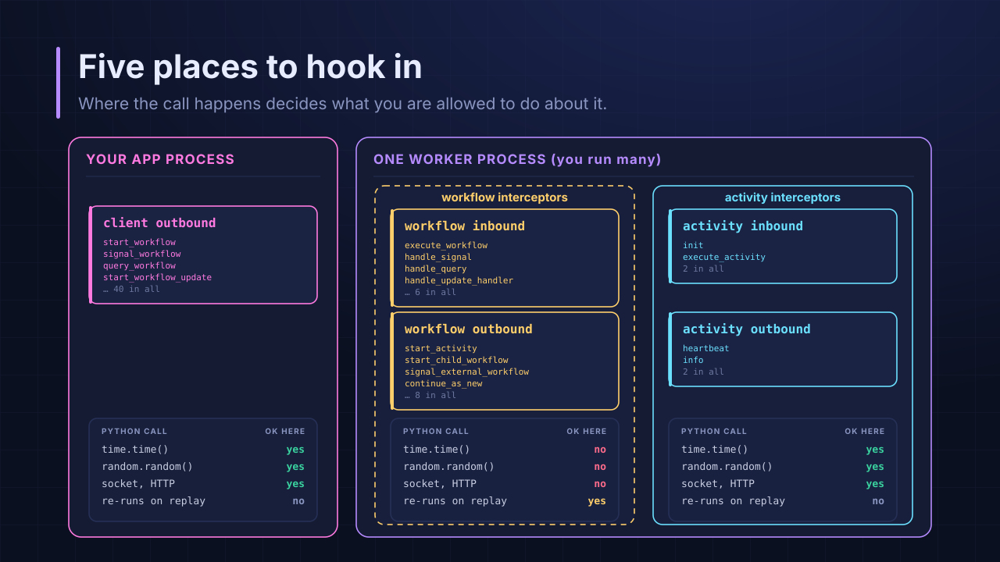

<!--

9:30 - 11:30

Where interceptors can run - client & worker

What are the types of interceptors? list the 5

Calls going into the primitive = inbound; calls going out from = outbound
-->

---

<!-- _class: bleed -->

<!--
11:30 - 14:30

1/ Extend the correct class - where it runs; Python Client.Interceptor & Worker.Interceptor

2/ Build a class that extends the specific type of interceptor you want to create, e.g. WorkflowInboundInterceptor, and over-ride methods of the Temporal SDK call, using the same signature. Delegate control back using super() or you short-circuit the chain (e.g. processing doesn't happen). You can raise errors to stop the call, too.

3/ Return an instance or the class back to the SDK and the SDK will register it into the chain of calls that will be made. Workflow interceptors are the class, activity and client are instances.

Register them! List out the order they run in, too!

-->

---

<!-- _class: bleed -->

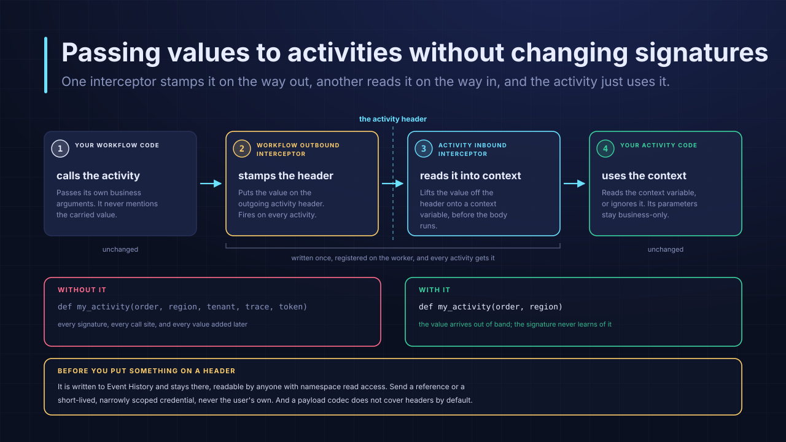

<!--
14:30 - 17:30

1/ Rufus wanted to not update signatures across his project but he needed the values like correlation id and the delegation grant

a/ workflow outbound interceptors read values and create activity headers
b/ activity inbound interceptors read the header and create context variables in python
c/ activities can use or ignore the variables

2/ Headers get written to history and he needed to set HeaderCodecBehavior in addition to using a codec server. 

-->

---

<!-- _class: bleed -->

<!--
17:30 - 19:00

Rufus built the interceptors to meet the non-functional requirements

1/ Real auth & Group check
2/ Write out the log when trips get approved (not the data of the approval)
3/ Search attributes and correlation ids for all logs
4/ using the delegation grant to get an access token for backend calls

Interceptors made it easier to use with other workflows, also added debug time.
-->

---

<!-- _class: bleed -->

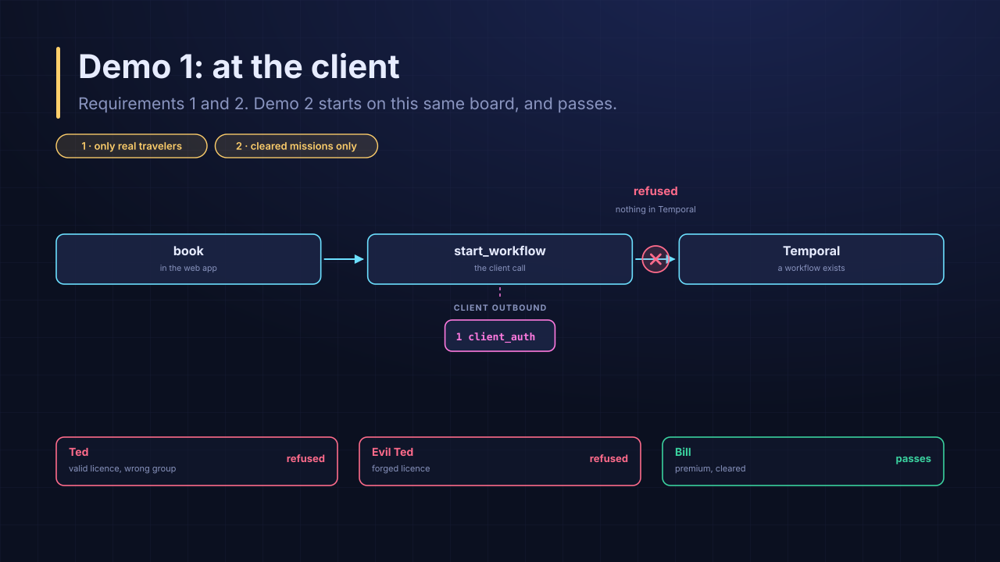

<!--
Show a few windows - traveler + admin browser
worker logs
backend system logs - the system that the worker calls to for time travel; requires an access token
temporal console
JWT Decoder

1/ Let's start with Auth cases - this demo shows the reason and is only for the demo!

a/ Ted trying to take a "save the future" -> declined invalid group; no workflow
b/ Evil Bill trying to take a "save the future" -> declined invalid JWT; no workflow

-->

---

<!-- _class: bleed -->

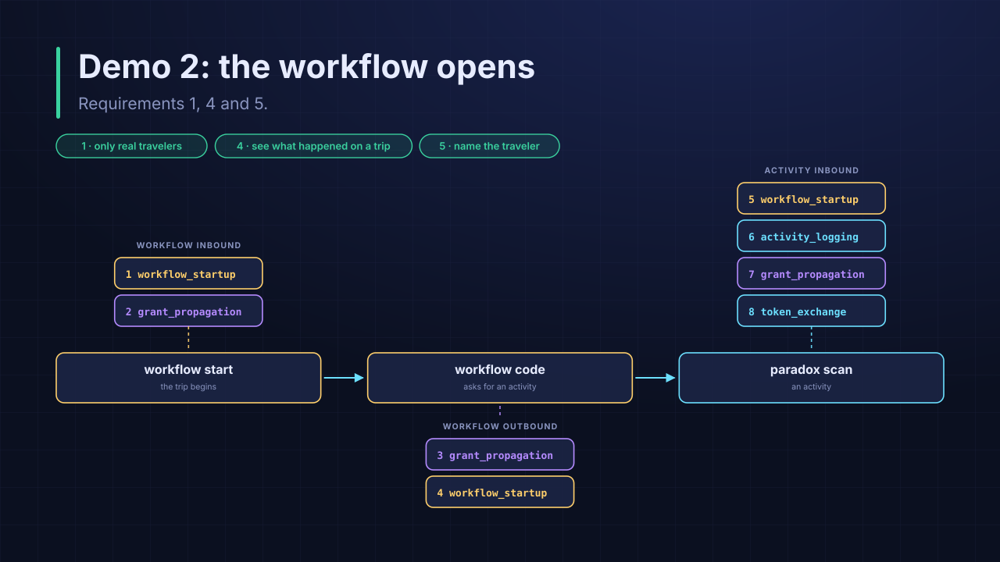

<!--

For a trip that starts:

1/ workflow startup - correlation id, validation of JWT (clock!) that uses an activity (note the interceptors this creates, but pass over them), upsert search attributes
2/ grant prop - writes the validated grant to memory

workflow outbound

1/ reads the validated grant -> header
2/ reads the correlation id -> header

actiivty inbound

1/ gets the correlation id
2/ logs the start of the activity
3/ gets the grant header
4/ exchanges grant for token

activity calls the backend using the token

5/ end of activity is logged

-->

---

<!-- _class: bleed -->

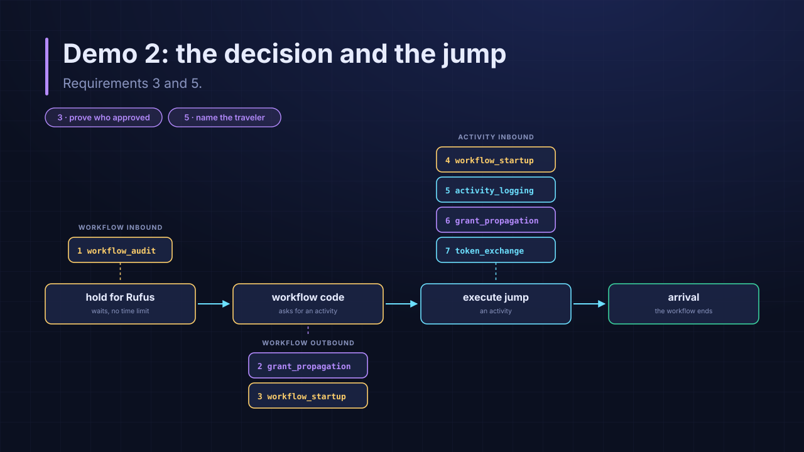

<!--

1/ workflow audit - captures that the signal came in, can write to another system

workflow outbound - repeat of earlier

1/ reads the validated grant -> header
2/ reads the correlation id -> header

activity inbound - repeat of earlier

1/ gets the correlation id
2/ logs the start of the activity
3/ gets the grant header
4/ exchanges grant for token

activity calls the backend using the token

5/ end of activity is logged

-->

---

<!-- _class: bleed -->

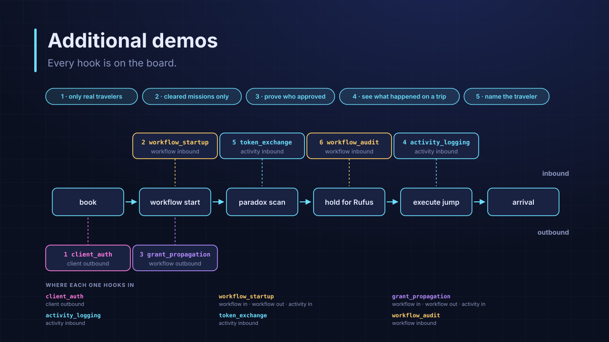

<!--

If we have time...

-->

---

<!-- _class: bleed -->

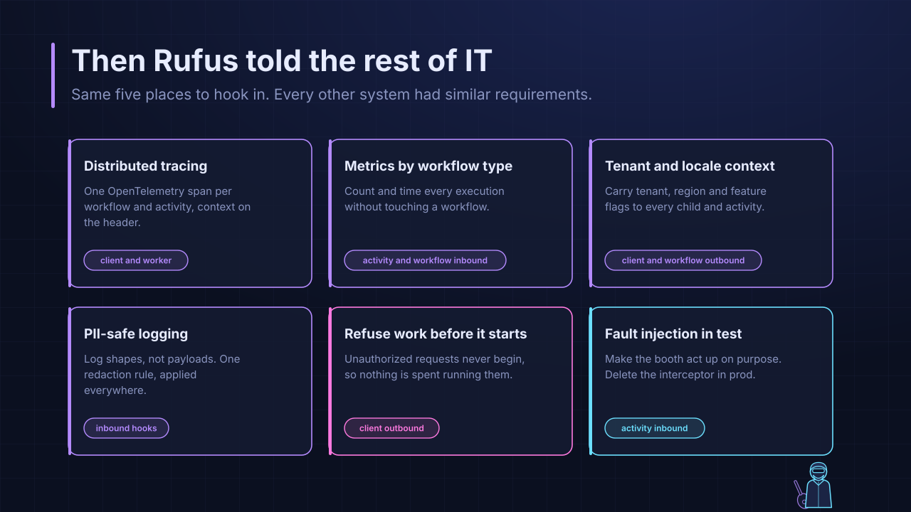

<!--

34:00 - 35:00

Rufus share other ideas for interceptors

-->

---

<!-- _class: bleed -->

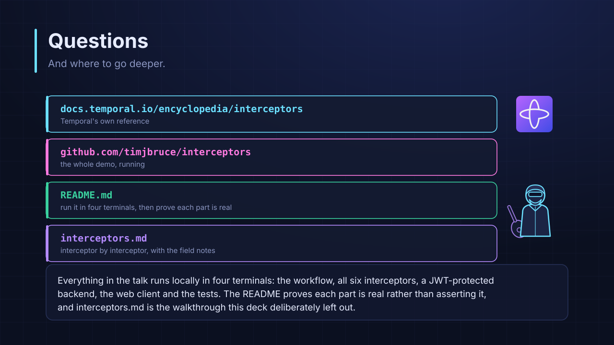

<!--
35:00 -  

Questions
-->
