<!--
Render:  npx @marp-team/marp-cli@latest presentation/interceptors-story.md -o deck.html
Runbook: presentation/README.md
-->

<!-- _class: bleed -->

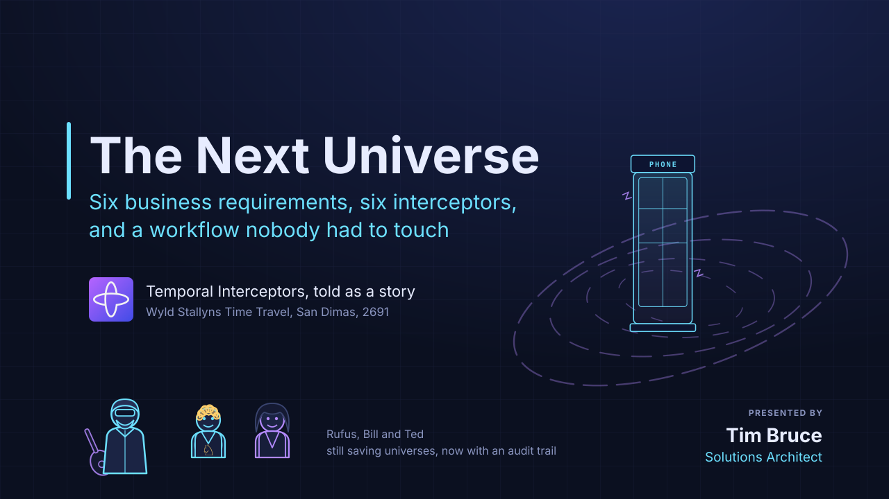

<!--
0:00 quick intro

I'm here to talk to you about Temporal interceptors. Before we begin, I want to call out something that I loved to hear when I started here. I've heard us say we  want to keep the "glue code" out of your workflows, and get stuff like retries, queues, and timers from Temporal. Well, businesses have their own "glue code", too. You might see it in non-functional requirements.

These non-functional requirements come in many forms - business rules, ensuring security, improving traceability and audit, and a wide variety of things. Rather than just share a tech demo with you, I want to tell you a story about a totally excellent dude and architect named Rufus, who is set to save universes.

If you have any questions, feel free to come off mute and ask them.

Before we begin: how many of you have run interceptors before? How about have built them?

-->

---

<!-- _class: bleed -->

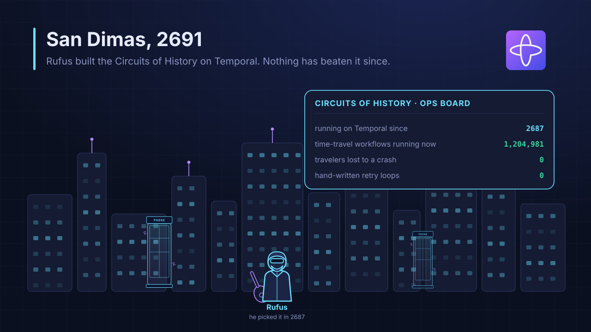

<!--
1:30 

Rufus selected Temporal as his durable execution environment in the 27th century. Everyone in the future knows Temporal is the best at what it does and it just keeps getting better. The phone booth operatred most excellently through the adventures of Bill and Ted. Rufus was never paged by a trip that couldn't be made!

-->

---

<!-- _class: bleed -->

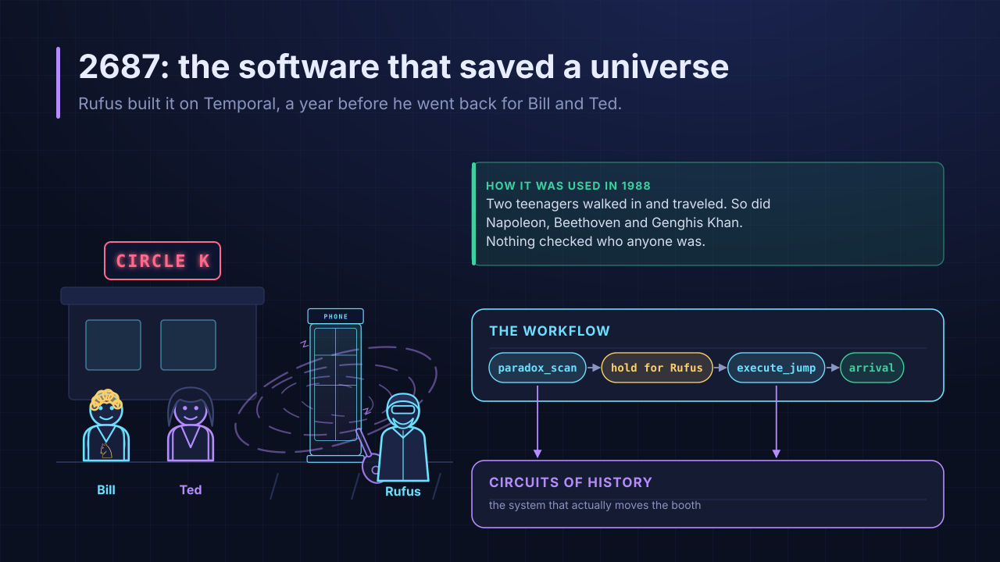

<!--

2:00 - 

Now, the worklow that Rufus created was pretty simple, but most excellent. All it had to do was make sure there weren't any time paradoxes for the trip, maybe check with Rufus if the trip was good, execute the jump, and the dudes would arrive at the time they dialed. A very simple business process supported by backend systems to power the circuits of history.

If someone needed to use the phone booth to access the circuits of history, all they had to do was lookup the information in the Circuits of Time Directory, enter it into the phone, and they were on their way. Very simple, worked like a charm! And, it saved the future!

-->

---

<!-- _class: bleed -->

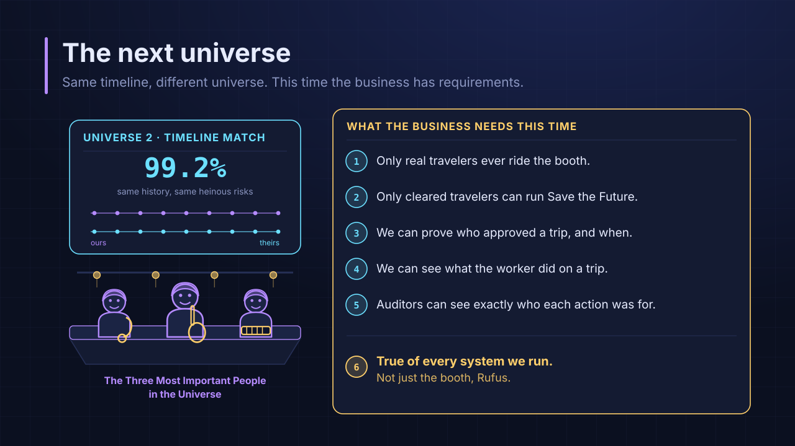

<!--
4:00

And, you know, no awesome deed goes unpunished in IT. Rufus was called in by the Three Most Important People in the Universe. The three had found other universes, a multiverse of Bill and Ted. And all of them needed saving. They knew their Rufus was the dude to do it because none of the others had a Rufus!

This time, they wanted to learn from their literal and figurative past. They did not want evil De Nomolos robots riding the circuits of history and creating problems, so they needed authentication and authorization. They also wanted one of the duo to be able to select the saving the future mission. The other IT services that worked the circuits of history backend needed better tracing tools, as they were concerned about find bogus errors when troubleshooting with many universes time traveling. And the most heinous of all, the auditors, needed to that when someone approved or denied a mission.

On top of this, they wanted Rufus to help implement these requirements in the other workflows that were run. This wasn't "glue code" to prevent failures. It was the Three Most Important People in the Universe--'s glue code to keep the future at peace.

-->

---

<!-- _class: bleed -->

<!--
5:30 - 

If you've seen the movies, you know a lot of what went wrong. For those who haven't, let's cover a couple of the problems that occurred.

First, De Nomolos, Rufus' old gym teacher, almost ruined the future by creating the most bogus evil twins of Bill and Ted. The evil twins were able to use the phone booth and sent the real Bill and Ted to the afterlife. This unauthorized use of the time booth was most heinous and could not occur again. The backend systems for the circuits of history had already been updated to be protected, and now the workflows needed to be updated to include security.

Also, Bill and Ted, thanks to Bill's little brother Deacon almost lost a head of state. Yeah, Napoleon. He was a d..a jerk to Deacon, but still. Napoleon was almost stuck at Waterloo, San Dimas' most awesome warterpark and home to the most excellent water slides. That and the expense report for the Ziggy Piggy still haunted Rufus.

Neither of these issues was a durability problem or a missing requirement for traveling through history. These were business glue problems that the Three Most Imporant People in the Universe were looking for Rufus to solve.

-->

---

<!-- _class: bleed -->

<!--
7:00 - Rufus also looked at the 6th requirment - solving these problems for all the other workflows that ran in the future. Rufus pondered about what to do for a little bit. He knew the answer was not to simply add code to all of these workflows, even using helper libraries. He couldn't promise that all the helper functions would be called at all the right points to pass and record the data that was needed. Also, there would be a lot of activity signatures that needed updating. It was a mess.

5 requirements, 48 workflows, all the activities. Yeah, libraries were a bogus answer and Rufus knew it.

Being the most excellent architect that he was, Rufus did some research using Temporal's AI developer assistant, asking the question "what is the best way to handle cross-cutting requirements that need to be handled for multiple activities and workflows?"

-->

---

<!-- _class: bleed -->

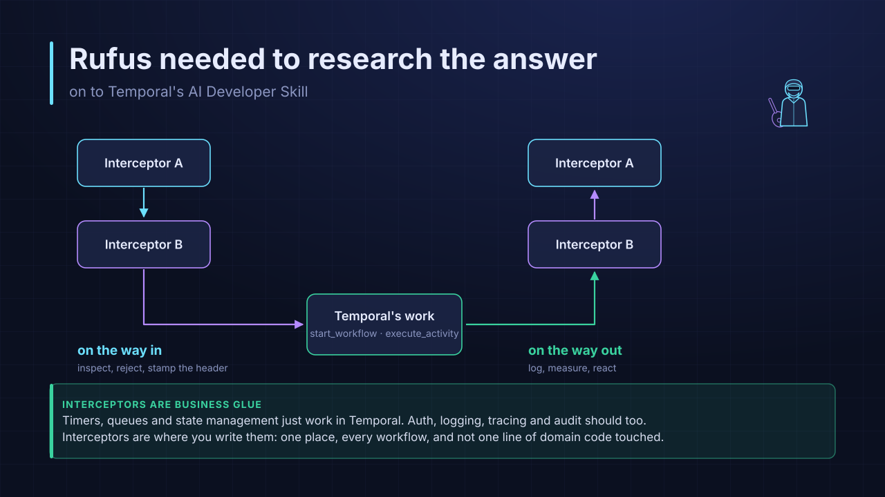

<!--
8:15 - Unsurprisingly, the AI Assistant came back with the answer of Interceptors. According to Temporal's documentation, Interceptors are SDK hooks that let you intercept inbound and outbound Temporal calls. Let's take a look at this in a graphical format to see what it means.

Let's say you have two interceptors, A and B, for a single Temporal call like execute_workflow. The Temporal call happens and the Interceptor framework intercepts the call. It runs the code for Interceptor A's execute_workflow inbound event, which then passes control to Interceptor B to run its code for the same inbound event, which then returns control to Temporal to run the code you wrote to handle the call. When your code to handle the call is complete, Interceptor B runs the rest of its event code, returns control to Interceptor A to run the rest of its event code, then the call is completed.

This shape might be very familiar to you. Django, Starlette, Flask, Express, gRPC interceptors. Same pattern, just pointed at Temporal calls.

One thing to note is that Interceptors need to delegate to the next call in the chain. If an Interceptor fails to do this, then the code short-circuits the chain and the real SDK call is never run. 

Rufus then started to dig further on what he needed to understand about interceptors and how to build them.
-->

---

<!-- _class: bleed -->

<!--
10:00 - 

The first thing he did was look at where Interceptors could be run. For his purposes, he stuck to the 5 main categories. There were 2 additional ones, but the Nexus interceptors were noted as experimental and not implemented across all the SDKs.

You see the 5 main types of interceptors highlighted on this slide in the colored boxes: client outbound, workflow inbound, workflow outbound, activity inbound, and activity outbound. He also highlighted some of the calls that could be intercepted within Temporal. This helped him to understand the events he could intercept and run the logic that was needed to meet the non-functional requirements. This wasn't just good information for him to build for himself, but it was information he could share with others.

He mapped where he thought his calls would go based on the main interceptor categories: from left to right, calls your app makes out; calls coming in to a workflow; calls a workflow makes out; on each activity attempt; calls an activity makes.

Then Rufus listed questions he felt everyone should know - what is safe to use within each of the Interceptors. Workflow interceptors run inside the sandbox and re-run on replay; client and activity interceptors do not, and an activity interceptor re-enters on every retry attempt. This rule followed the rules for avoiding nondeterminism errors and highlighted which of the interceptors would execute on replay. Note that these generally follow the rules of their primitives.

-->

---

<!-- _class: bleed -->

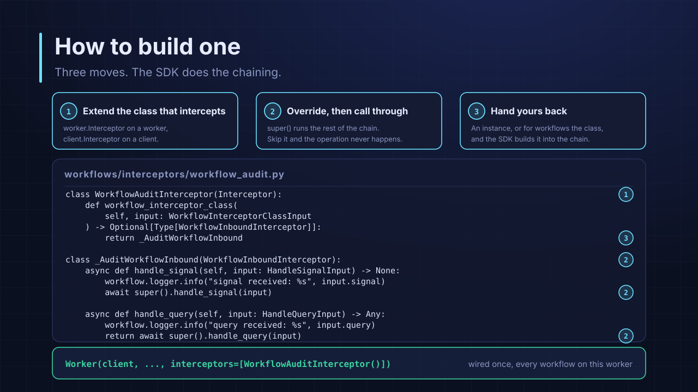

<!--
12:30

Rufus then created a guide on how to create the most excellent of interceptors. It was pretty simple - 

1/ Extend the correct class that intercepts. In Python, ou should use the Client.Interceptor and Worker.Interceptor classes to inherit from for this first step, depending on the location of your interceptor.

2/ Create another class extending the specific type of interceptor you want to create, e.g. WorkflowInboundInterceptor, and over-ride the call by writing a method inside the class. The method name and parameters need to match the exact Temporal SDK call. Also, make sure to delegate control to the next item in the chain at the end of your interceptor.

3/ Return an instance or the class back to the SDK and the SDK will register it into the chain of calls that will be made. In this case, A worker interceptor's `workflow_interceptor_class()` returns a `WorkflowInboundInterceptor` subclass and the SDK constructs one per workflow instance; client and activity interceptors are handed back as instances.

Finally, pictured at the bottom is the code sample to register the interceptors, in this case with a worker. It simply needs to be added to an ordered list on either the worker or client.

An important note is that the Interceptors will register and run in order they are listed. If you have multiple Interceptors for a single Temporal call, they will execute in a specific order. Inbound and client interceptors will run in the order listed. Outbound interceptors will run in reverse order. If you have an interceptor that could invalidate a workflow or cancel an activity, you should think about putting that interceptor near the start of your list so you can prevent needless work from occuring.

-->

---

<!-- _class: bleed -->

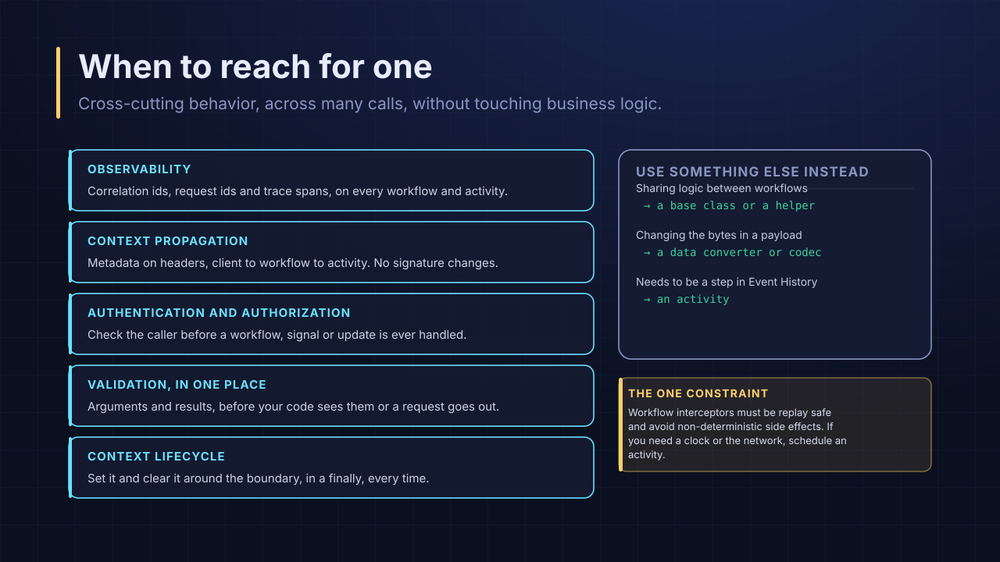

<!--

15:00 
With that complete, Rufus started another guide about when to consider an interceptor. In architecture and in interceptors, there is no right and wrong. However, interceptors could help to reduce maintenance overhead by simplifying the number of things that developers needed to remember when updating their workflows.

For instance, if you have an observability interceptor registered for every execute_activiity, you could add a new activity to your workflow and not worry about ensuring you have all the correct parameters and are logging correctly in your activity.

But remember that interceptors are not free. There can be overhead in debugging and workflow interceptor code is, for all intents and purposes, workflow code since it runs on re-play.
-->

---

<!-- _class: bleed -->

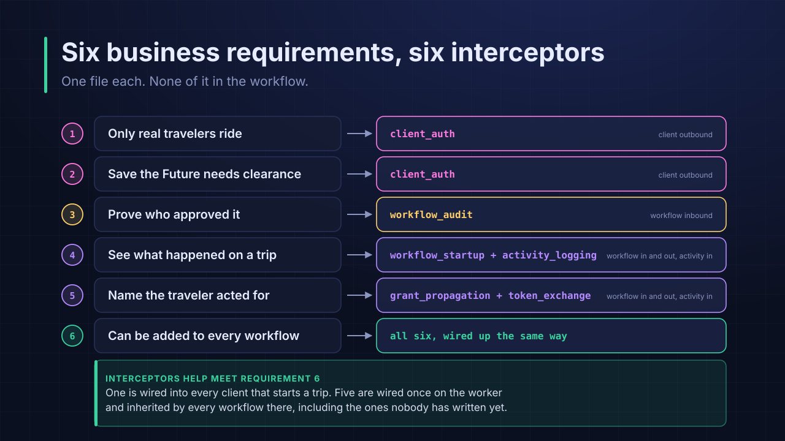

<!--
15:30 - 

So Rufus went and built the interceptors for his project. He looked at each of the concerns and the different types of interceptors that he could build. Then, he matched the best type of interceptor(s) to meet the requirement. What you see here is Rufus' implementation of the interceptors.

The client interceptor was interesting. This one executed before the client start_workflow call was sent to Temporal. If the user's JWT wasn't valid or the permissions of the user weren't correct for the mission, the client would not complete the call and no workflows are started. This interceptor would not fire if someone ran the workflow from the command line, but it did stop within the application.

The Audit request is handled simply by a workflow inbound interceptor that overrides the `handle_signal` and `handle_query` calls.

Two requirements, for seeing what happened on a trip and using the user's grant on the backend, are handled by a mix of workflow and activity interceptors. Workflow inbound starts the work - ensuring there is a correlation id; checking the delegation grant for validity, via an activity; and upserting the search attribute values into the workflow. Workflow outbound interceptors are used to create headers for each activity request, containing the correlation id and the grant. Then the activity inbound interceptors read these values and make them available for the activity execution context without needing to alter the activity signature. This is the mechanism the Python SDK provides for context propagation of values to activities via interceptors.

Note that Rufus also needed an activity to validate the grant during the workflow startup interceptor. This protected the edge of the workflow if someone ran the workflow from the command line.

-->

---

<!-- _class: bleed -->

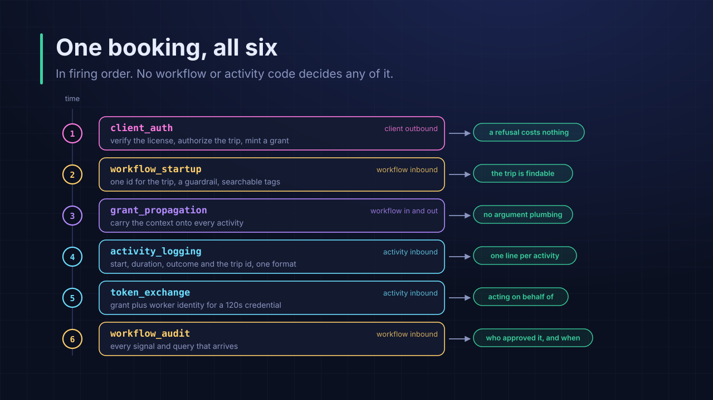

<!--

This is what one booking looks like, in execution order. We get security at the edge, findability of workflows, carrying grants and correlation ids without having to change activity signatures.

Backend services can record who requested the mission, because the grant is exchanged for a short-lived token that names both the worker and the traveler. 

We also get consistent and correlatable logging, and a record of when decisions arrived.

These requirements were cross-cutting through the project, and possibly for other projects too. Let's take a look at it in action.

-->

---

<!-- _class: bleed -->

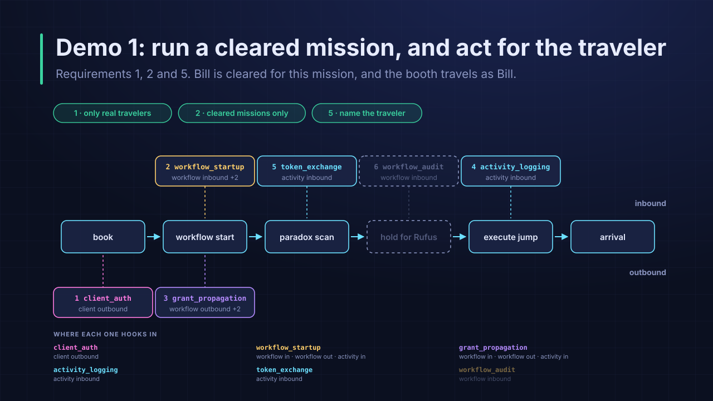

<!--
DEMO 1 (~2.5 min) - requirements 1, 2, and 5. Leave this slide up while you drive.

For the first demo, I'm going to login as Bill, a premium user. Bill can book the "Save the future" mission and I'm going to hope that there's no need for Rufus to approve this one for this trip. If it does come up, I'll just approve the trip so it can continue. We'll come back to that demo later, so I may gloss over it.

What we will see is the client outbound interceptor validates Bill's JWT, because it is valid, and validates he has permissions because of his group membership in the premium group. The client then starts the workflow. The workflow startup interceptor will create a correlation id from the workflow run_id, assuming the client did not send in a correlation id, check the validity of the grant that Bill's client sends in, via an activity, and upsert Bill and Save the future as custom workflow attributes. Then, we'll see the process move forward and Bill will be sent to the future. For the activity.  we'll see an exchange grant line recorded via grant propagation on the workflow outbound and a token exchange, as we get the short-term grant. Then, the activity inbound grant propogation reads the header and makes it available for the activity context.

The headers that we are using in this demo will also be recorded in Temporal. We'll take a look at those for the workflow and activity after we watch the trip conclude.

-->

---

<!-- _class: bleed -->

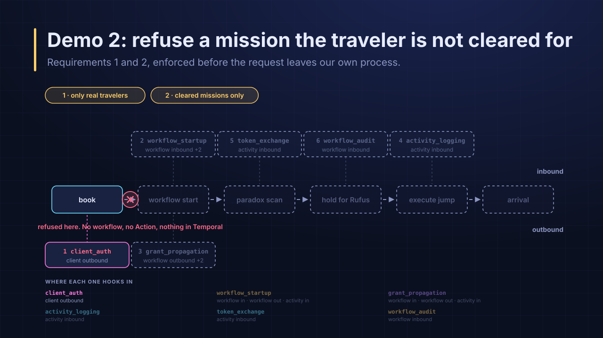

<!--
DEMO 2 (~1.5 min) - requirements 1 and 2, and the cheapest possible no.

Next, we're going to try the same mission as Ted. Ted isn't in the premium group. When the client outbound interceptor checks for his JWT, it will find the token is valid. But, because he doesn't have membership in the premium group, we'll see that this is refused in the UI.

After we see that it is refused in the UI, we'll check in the Temporal UI and see that no workflow was started for Ted.

**After Demo**

Note that Ted isn't an attacker, he's a valid user. Without the client outbound check like this, a customer would pay for a number of billable actions, for starting the workflow and possibly for an activity to validate the user's token and group membership.

Now let's login as someone with a forged token, Evil Ted. Evil Ted will be refused by the same client outbound interceptor, just like Ted was. But, Evil Ted will be denied because his JWT cannot be vvalidated. Again, we also skip the call to start the workflow.
-->

---

<!-- _class: bleed -->

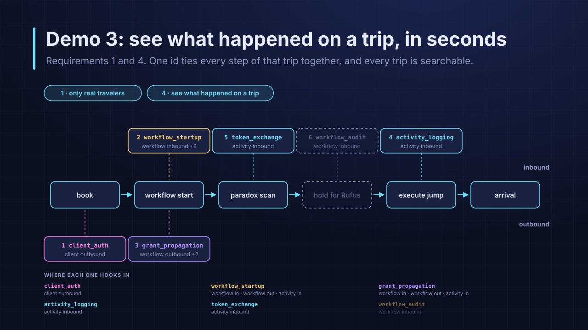

<!--
DEMO 3 (~2 min) - requirements 1 and 4. Cut this run first if you are behind.

We're going to back to Ted and book a regular trip this time, one to "Ace our history report". In this case, we'll havve a support lead that thinks something strange has occurred and will want to see what happened on the trip.

We'll look at the backend as this trip occurs and see the correlation id is recorded in the logs for the worker. We'll also look in the UI and see the custom attributes that are saved for the trip for Ted and the Ace our history report mission.

The correlation id is passed to the activities from the workflow via headers. This is done by the workflow_startup outbound start_activity interceptor stamping the correlation id on the activity header and the startup interceptor's activity-inbound interceptor reads the value into context for the activity. 

-->

---

<!-- _class: bleed -->

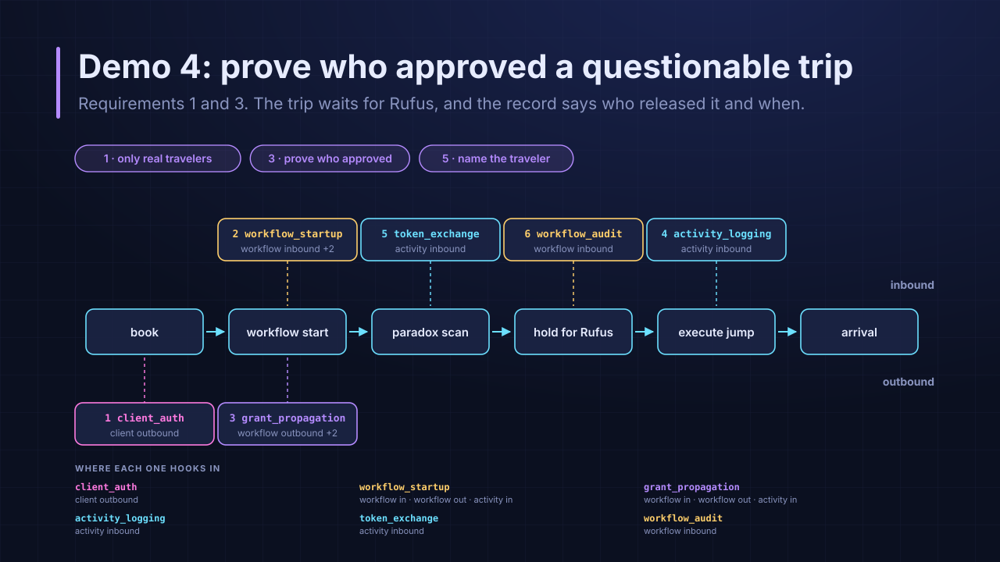

<!--
DEMO 4 (~3 min) - requirements 1 and 3, and the best story of the four.

Now, we're going to look at the step for auditing. We'll take Bill on a save the future mission and we'll see the same steps we did in demo 1.

As a reminder: The client outbound interceptor validates Bill's JWT, because it is valid, and validates he has permissions because of his group membership in the premium group. The client then starts the workflow. The workflow startup interceptor will create a correlation id from the workkflow run_id, check the validity of the grant that Bill's client sends in, via an activity, and upsert "Bill S. Preston, Esq" and "Save the future" as custom workflow attributes. Then, we'll see the process move forward and Bill will be sent to the future. For the activity, we'll see an exchange grant line recorded via grant propagation on the workflow outbound and a token exchange, as we get the short-term grant. Then, the activity inbound grant propogation reads the header and makes it available for the activity context.

Additionally, we're going to get Rufus involved for audit. We'll see the workflow handle_signal interceptor run and log the fact that a decision was made on the mission, but not who or what the decision was. Not in the logs. The actual data for the approver will be stored from the workflow into Temporal. We'll take a look at it there.

Finally, the other delta in this use case is that the approval could happen hours later. the grant lives 8 hours and the exchange mints a fresh 120 second access token per activity attempt, so an approval hours later still allows for Bill to travel.

-->

---

<!-- _class: bleed -->

<!--
30:00 - 

Requirement 6 said every system, so Rufus went and told the rest of IT. You've heard the story and seen the proof of the work. He started working with others to get the platform team to own this common set of interceptors, enabling the work across his organization. Not to mention, he saved the multi-verse. What of these use cases are interesting to you?

-->

---

<!-- _class: bleed -->

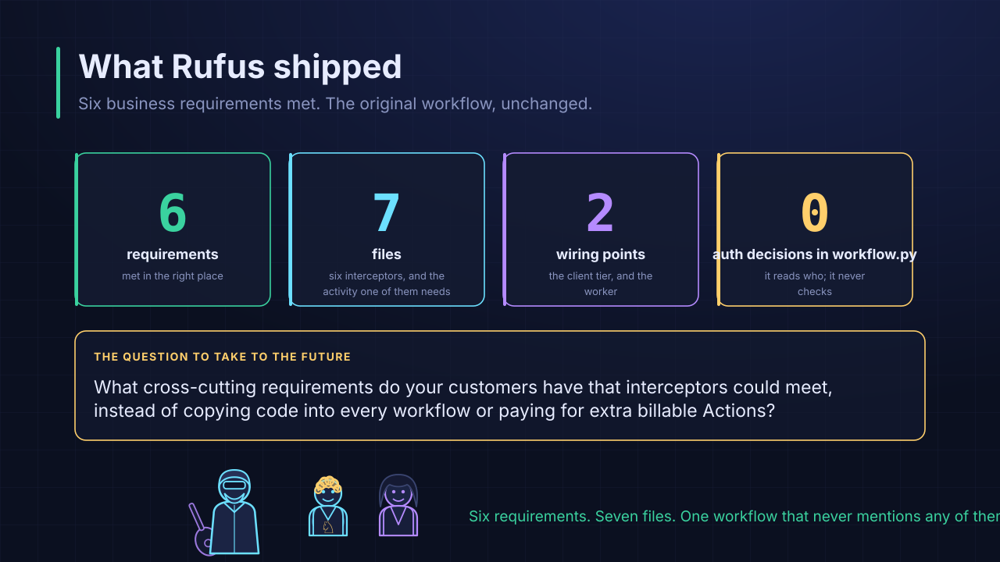

<!--
32:00 - Six non-functional requirements, met where each could be met. Seven files. Just two wiring points, the client and the worker. No need to update the workflow and activities to include all of the data passing and plumbing.

-->

---

<!-- _class: bleed -->

<!--
33:30 - Questions
-->
